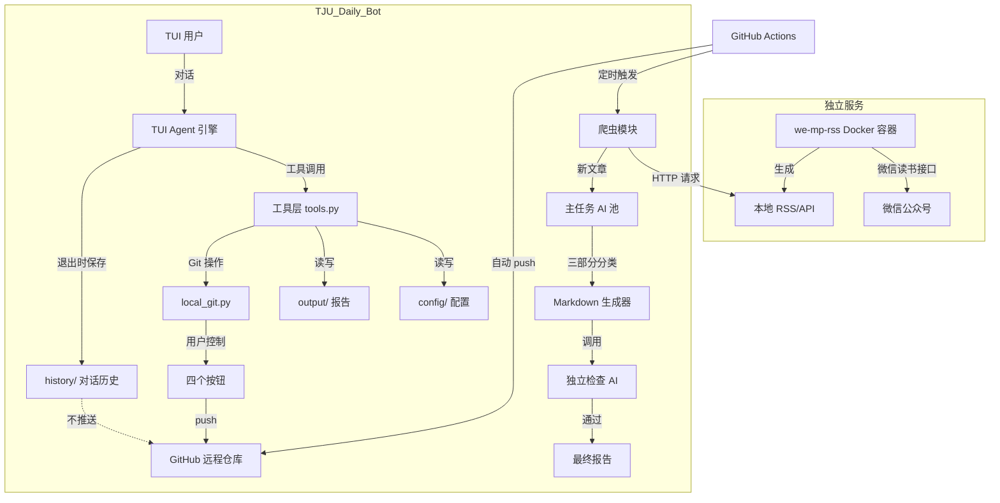

# 文件 1：PROJECT_PLAN.md（项目方案）

# 天津大学每日智能信息简报系统 (TJU Daily Bot)

## 1. 项目概述

基于 GitHub Actions 与本地 TUI 终端，每日定时抓取天大官网及微信公众号更新，经 AI 生成个性化简报并推送至用户自己的远程仓库。

**公众号数据获取方案**：采用 **we-mp-rss** 独立服务（基于微信读书接口，稳定可靠），通过 RSS/API 方式获取公众号文章数据，与主项目解耦。

**核心特性**：
- 三类 AI 配置独立：主任务模型池、检查器、TUI Agent
- 工具调用优先，自动降级为自然语言提示
- 对话历史持久化与轮转（不推送远端）
- 四种 Git 控制操作：仅Commit、Commit & Push、仅Save、退出
- 基于 SQLite 的本地搜索索引
- 历史加载与命令白名单

## 2. 核心功能需求

| 序号 | 功能 | 实现要点 |
| :--- | :--- | :--- |
| 1 | 本地 TUI 界面 | Textual 框架，左右分栏（对话区 + 文件列表），底部四个 Git 控制按钮 |
| 2 | 时间戳命名简报 | 输出文件名 `YYYY-MM-DD_HH-MM-SS.md` |
| 3 | 用户个性化 | `user_profile.yaml` 存储学历、学院、专业，注入 AI Prompt |
| 4 | 关键词管理 | `keywords.txt`，TUI Agent 可追加关键词 |
| 5 | 增量抓取 | 记录 `state.json` 上次运行时间及已处理链接，仅处理新内容 |
| 6 | 信源只限天大 | 官网列表页（CSS 选择器配置）+ 公众号（通过 we-mp-rss 获取） |
| 7 | 三部分报告 | Part1 关键词命中、Part2 AI 推荐、Part3 其余 |
| 8 | 主模型故障转移 | 从 `models.yaml` 读取 `main_models`，顺序尝试 |
| 9 | TUI 实时搜索 | 基于 SQLite 索引进行全文检索 |
| 10 | 独立 AI 检查 | 从 `models.yaml` 读取 `checker`，校验报告合规性 |
| 11 | TUI Agent 文件读写 | 工具：读/写配置文件、关键词、报告列表、Git 控制 |
| 12 | TUI Agent 独立配置 | `config/tui_agent.yaml` 指定模型、工具 schema、历史管理 |
| 13 | 对话历史存储与轮转 | 退出时保存至 `history/`（不推送远端），基于时间戳轮转 |
| 14 | Git 控制按钮 | 「仅Commit」「Commit & Push」「仅Save」「退出」 |
| 15 | 工具调用自动降级 | Function Calling 失败时降级为自然语言提示 |
| 16 | 命令白名单 | 仅完全匹配 `/load_history`、`/save`、`/quit` 时识别为命令 |
| 17 | 搜索性能优化 | SQLite 索引缓存文章标题、摘要、链接、时间 |

## 3. 系统架构图



## 4. 目录结构

```
TJU_Daily_Bot/
├── docker-compose.yml          # we-mp-rss 服务编排
├── tui/
│   ├── app.py                  # Textual 主界面
│   ├── agent.py                # Agent 引擎
│   ├── tools.py                # 工具实现
│   ├── local_git.py            # Git 封装
│   └── search_handler.py       # SQLite 搜索索引
├── config/
│   ├── user_profile.yaml
│   ├── keywords.txt
│   ├── sources.yaml            # 信源配置（含 rss_url）
│   ├── models.yaml
│   └── tui_agent.yaml
├── src/
│   ├── crawler/
│   │   ├── web_crawler.py      # 网站抓取
│   │   └── wechat_rss_crawler.py  # 从 we-mp-rss 获取
│   ├── ai_engine/
│   │   ├── fault_tolerant_client.py
│   │   └── independent_checker.py
│   └── main.py
├── output/                      # 生成的报告
├── history/                     # 对话历史（不推送）
├── state.json
├── requirements.txt
├── .env.example
└── .github/workflows/daily.yml
```

## 5. Git 提交策略

| 操作 | 提交内容 | 推送远端 | 提交信息前缀 |
| :--- | :--- | :--- | :--- |
| **仅Commit** | 当前所有变更 | ❌ 否 | `data:` |
| **Commit & Push** | 当前所有变更 | ✅ 是 | `data:` |
| **仅Save** | 仅保存文件到本地 | ❌ 否 | 无 |
| **退出** | 自动保存 + Commit & Push | ✅ 是 | `data: session end` |
| **Actions 自动运行** | 仅 output/ + state.json | ✅ 是 | `data: daily report` |

**提交内容分离原则**：
- `output/`：推送至远端（历史报告完整保留）
- `config/`：仅用户通过 TUI 按钮显式提交时推送
- `state.json`：Actions 和 TUI 共享，推送至远端
- `history/`：**永不推送**（已加入 .gitignore）

## 6. 技术难点与解决方案

| 难点 | 解决方案 |
| :--- | :--- |
| 微信公众号数据获取 | **we-mp-rss 独立服务**：基于微信读书接口，Docker 部署，提供 RSS/API |
| we-mp-rss 服务不可用 | 降级为 TUI 手动录入（用户粘贴文章链接） |
| GitHub Actions 无法访问本地服务 | Actions 中跳过公众号抓取，仅抓取官网；公众号内容由用户本地 TUI 补充 |
| 网站增量更新识别 | `last_run` 时间戳 + `processed_links` 集合双重去重 |
| 网站列表页结构变化 | `sources.yaml` 中配置 CSS 选择器 |
| AI 返回 JSON 解析失败 | Prompt 强制纯 JSON + jsonrepair + 正则纠错 + 最多 2 次重试 |
| Git 冲突 | 提供冲突文件列表和解决指引 |
| 搜索性能 | SQLite 索引，定期清理孤立记录 |
| 模型降级后仍无法理解 | 严格 System Prompt + Few-shot + 意图预判 + 重试 |
| 对话历史管理 | 退出时序列化至 history/，不推送远端，基于时间戳轮转 |

## 7. 开发里程碑（14 天）

- **Day 1-2**：Fork 参考项目，创建目录结构，编写 docker-compose.yml
- **Day 3-4**：实现 `user_profile` 注入和主模型故障转移
- **Day 5-7**：Textual TUI 骨架，右侧文件列表，四个 Git 控制按钮
- **Day 8-10**：三部分分类逻辑、独立检查模块、SQLite 搜索索引
- **Day 11-12**：Agent 引擎、工具层、历史存储与轮转
- **Day 13-14**：全链路联调，完善错误处理和文档

## 8. 风险预案

| 风险 | 预案 |
| :--- | :--- |
| we-mp-rss 服务未启动 | TUI 启动时检测服务健康状态，若不可用则提示用户执行 `docker-compose up -d` |
| we-mp-rss 接口失效 | 降级为 TUI 手动录入表单，用户粘贴文章标题、链接、摘要 |
| GitHub Actions 无法获取公众号 | 仅抓取官网信源，日志记录 "Skipping wechat RSS in Actions environment" |
| 网站列表页改版 | 用户更新 `sources.yaml` 中的 CSS 选择器 |
| AI 成本超限 | 主模型日限额，检查模型 token ≤ 500 |
| Agent 模型无法理解指令 | 正则意图识别 + Few-shot + 最多 2 次重试 |
| Git 提交冲突 | 提供冲突文件列表和解决指引，Actions 冲突则放弃并记录 |

## 9. 验收标准

- [ ] 网站爬虫正常工作，支持 CSS 选择器配置
- [ ] `wechat_rss_crawler.py` 能成功从 we-mp-rss 获取公众号文章
- [ ] TUI 启动时检测 we-mp-rss 服务健康状态
- [ ] we-mp-rss 不可用时，TUI 提供手动录入入口
- [ ] Actions 运行日志正确显示 "Skipping wechat RSS in Actions environment"
- [ ] 增量更新通过 `last_run` 和 `processed_links` 双重机制实现
- [ ] TUI 文件列表点击调用系统编辑器打开
- [ ] 修改 profile 后 Part 2 推荐内容相应变化
- [ ] `models.yaml` 可自由增删改模型
- [ ] `tui_agent.yaml` 包含 `tools_schema` 和 `prefer_function_calling`
- [ ] Agent 支持自然语言降级，解析失败时最多重试 2 次
- [ ] 对话中可添加关键词、修改画像、查看/打开报告、搜索信息
- [ ] 所有文件写入操作仅限白名单目录
- [ ] 每次 Markdown 尾部含独立 AI 检查报告
- [ ] TUI 提供「仅Commit」「Commit & Push」「仅Save」「退出」四个按钮
- [ ] 每次退出 TUI 时，`history/` 下生成 JSON 文件（不推送远端），保留最近 30 个
- [ ] 启动 TUI 时自动检测并提示加载最近历史
- [ ] 命令识别仅匹配白名单（`/load_history`、`/save`、`/quit`）
- [ ] `.gitignore` 包含 `history/` 和 `.env`
- [ ] 初次运行检测 `.env` 文件，若不存在则引导创建
- [ ] Git 提交不使用 `--force`，推送分支为 `main`
- [ ] Actions 提交仅包含 `output/` 和 `state.json`
- [ ] 搜索功能使用 SQLite 索引，响应时间 < 2 秒